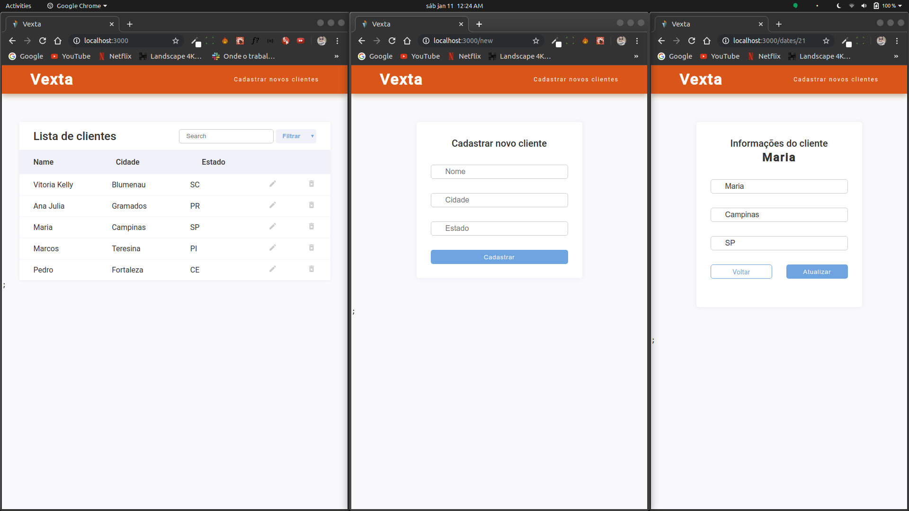

<h1 align="center">
 
  
 
 
TESTE NODE + REACT - VEXTA
</h1>

Projeto CRUD desenvolvido para seleção da Vexta

  

## Features

[//]: # "Add the features of your project here:"

Features usadas no Projeto.

- ⚛️ **React Js**
- 💹 **Node Js**

## Getting started

- Na pasta backend contém um arquivo _clientes.sql_ para a criaçao do banco de dados em MySql.

- Execute `yarn dev` ou `npm run dev` na pasta backend.

- Execute `yarn start` ou `npm start` na pasta frontend.
